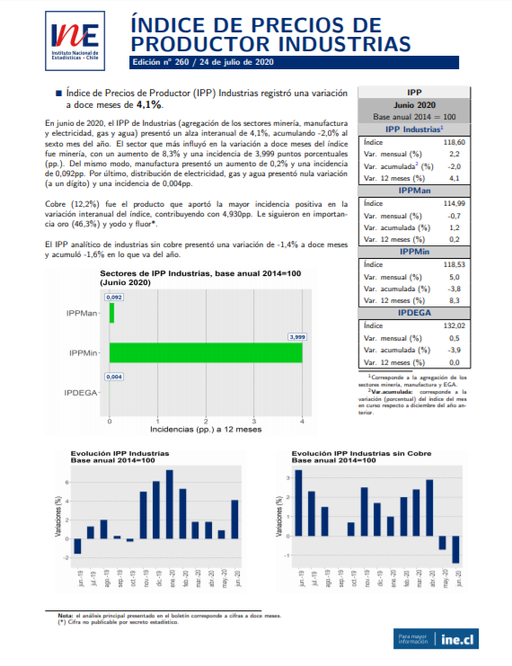

class: center, middle

.linea-superior[]
.linea-inferior[]


## Capacitación en R y herramientas de productividad

## Introducción y herramientas de exploración de datos

### Agosto 2020

```{r setup, include=FALSE}
options(htmltools.dir.version = TRUE)
knitr::opts_chunk$set(message = FALSE) 
```

```{r xaringan-themer, include=FALSE, warning=FALSE}
library(xaringanthemer)
#style_duo_accent(
 # primary_color = "#1381B0",
  #secondary_color = "#FF961C",
  #inverse_header_color = "#FFFFFF"
#)
```


---

background-image: url("imagenes/fondo2.PNG")
background-size: contain;
background-position: 100% 0%

# PE Servicios Compartidos

--

.medium-par[Esta actividad de capacitación se enmarca en el **PE SSCC**.]

--

.medium-par[El PE SSCC es uno de los 4 proyectos estratégicos actualmente en funcionamiento en el INE (2018-2022).]

--

.medium-par[Este proyecto busca:]

--

*"Proveer a la institución de estándares y desarrollos que permitan .red[automatizar], .red[estandarizar], .red[ordenar] e .red[innovar] en la producción estadística, permitiendo reducir .red[tiempos] y .red[costos] del procesamiento y análisis de los diferentes productos del INE y minimizando la probabilidad de .red[errores] en la publicación de resultados".* 

---

background-image: url("imagenes/fondo2.PNG")
background-size: contain;
background-position: 100% 0%

# Estructura PE SSCC


---

background-image: url("imagenes/fondo2.PNG")
background-size: contain;
background-position: 100% 0%

# Estructura PE SSCC


---
background-image: url("imagenes/fondo2.PNG")
background-size: contain;
background-position: 100% 0%

# Objetivos del aprendizaje

--

.medium-par[Al finalizar la capacitación se espera que los participantes:]

--

- **Estén familiarizados con el lenguaje de programación R** y cuenten con las habilidades necesarias para **profundizar aspectos de su interés** en este lenguaje.

--

- Sean capaces de **explorar** y **transformar** objetos en R.

--

- Manejen herramientas de **visualización** en R.

--

- Aprendan **buenas prácticas de escritura de código** en R.

--

- Conozcan la **herramienta git** para el control de versiones en el desarrollo de proyectos de datos.

--

- Conozcan **recomendaciones** que les permitan hacer **reproducibles** y **trazables** sus rutinas en R. 

--

- Conozcan herramientas para la **automatización de reportes** y de **tareas de procesamiento y análisis de datos**. 

---

background-image: url("imagenes/fondo2.PNG")
background-size: contain;
background-position: 100% 0%

# Organización de la capacitación

--

- La capacitación se compone de **10 sesiones**.

--

- Las sesiones de realizarán **semanalmente**, los días **miércoles entre 10:00 y 13:00** (a excepción de esta).

--

- Haremos una pausa de 10 minutos durante la sesión, en un momento a convenir.

--

- Si van surgiendo dudas, pueden consultar **levantando su mano** (Teams) durante la clase.

--

- Compartiremos la presentación antes del inicio de la sesión. Si existen correcciones detectadas, actualizaremos el repositorio durante la semana posterior.

--

- Al finalizar cada sesión se les presentará un desafío para resolver durante la semana 🏠.


---

background-image: url("imagenes/fondo2.PNG")
background-size: contain;
background-position: 100% 0%

# Contenidos de la capacitación

.medium-par[**PARTE I: HERRAMIENTAS BÁSICAS**]

--

**Sesión 1:** Introducción y herramientas de exploración de datos

    - ¿Qué es R y por qué usarlo?
    - La interfaz de R Studio
    - Exploración y manipulación básica de un data frame
    - Cargar datos desde distintos formatos a R

--

**Sesión 2:** Procesamiento de bases de datos (1)

    - Encadenamiento de instrucciones: manejo de pipes (%>%)
    - Transformación de datos (creación y edición de variables)
    - Estadística descriptiva (medidas de dispersión y tendencia central)
    - Agregación de unidades con group_by

--

**Sesión 3:** Procesamiento de bases de datos (2)

    - Unión de bases de datos (joins, binds)
    - Manejo de variables de tiempo (fechas, horas)
    - Manejo de variables factor

---

background-image: url("imagenes/fondo2.PNG")
background-size: contain;
background-position: 100% 0%

# Contenidos de la capacitación

--

**Sesión 4:** Visualización de datos usando el paquete ggplot2

    - Visualizar para comunicar efectivamente
    - La gramática de los gráficos: visualizar datos con ggplot2  

--

**Sesión 5:** Funciones y estilo de código 

    - ¿Qué es una función?
    - ¿Por qué son importantes las funciones?
    - ¿Cómo crear funciones en R?
    - Creando mi primera función para mi trabajo diario
    - Buenas prácticas para la escritura de código

--

.medium-par[**PARTE II: APLICANDO LO APRENDIDO**]

**Sesión 6:** Validación de datos

    - Introducción al paquete validate
    - Creación de reglas de validación
    - Reporte de validación (usando funciones de validate)

---

background-image: url("imagenes/fondo2.PNG")
background-size: contain;
background-position: 100% 0%

# Contenidos de la capacitación

--

**Sesión 7:** Más sobre edición de datos

    - Editando variables con dplyr
        - Case_when
        - Varias columnas a la vez (Mutate_*)
    - Edición de variables de texto
        - Grep, grepl y gsub
        - Introducción a las expresiones regulares 

--

**Sesión 8:** Trabajando con varias tablas simultáneamente

    - Ciclo for
    - Purrr (map, map_df)
    - Leer un conjunto de archivos desde una carpeta (usando funcionales) 
    - Editar un conjunto de tablas de manera eficiente 
    - Generar tabulados para varias tablas 
    - Generar reporte gráfico para varias tablas 

---

background-image: url("imagenes/fondo2.PNG")
background-size: contain;
background-position: 100% 0%

# Contenidos de la capacitación

--

**Sesión 9:** Data.table para el manejo de grandes volúmenes de datos

    - Es hora de abandonar dplyr (dplyr vs data.table) 
    - Creación de un objeto data.table 
    - Sintaxis básica de data.table 
    - Consultas a la base de datos 
    - Transformación de datos (edición y creación de variables) 

--

**Sesión 10:**  En camino a la reproducibilidad

    - ¿Por qué es importante el trabajo reproducible? 
    - Introducción a Rmarkdown 
        - Insalación 
        - ¿Qué es RMarkdown? 
        - Creando mi primer reporte con RMarkdown 
    - Introducción a git y github
        - ¿Qué es el control de versiones? 
        - ¿Qué es git?
        - ¿Qué es github?
        - Combinando R con git
 
---

class: center, middle

.linea-superior[]
.linea-inferior[]


.big-par[Antes de comenzar]

--

.big-par[¿Qué saben de R?]

.big-par[🤓]

---

background-image: url("imagenes/fondo2.PNG")
background-size: contain;
background-position: 100% 0%

# ¿Qué es R y por qué usarlo?

--

**R** es un lenguaje de programación creado por dos profesores de estadística de la Universidad de Auckland en 1993 (**Robert Gentleman y Ross Ihaka**).

--

**R** es gratis, su código es abierto y se encuentra disponible en la mayoría de las plataformas (Windows, Mac OS, Linux).

--

¡Es muy versátil! Hoy es utilizado para abordar problemas de distintas disciplinas, sobre todo de estadística.

--

Posiblemente las **técnicas o metodologías más recientes tengan alguna aplicación en R**. Los investigadores muchas veces publican un paquete del programa en compañía de sus artículos.

--

**Su lenguaje esta hecho para el análisis de datos**. Esto incluye características como valores perdidos (*missing values*), manipulación de *data frames* y selección de casos.

---

background-image: url("imagenes/fondo2.PNG")
background-size: contain;
background-position: 100% 0%

# ¿Qué es R y por qué usarlo?

--

.medium-par[¡Su comunidad de usuarios es muy activa!]

--

Se puede contectar con una comunidad local y global de usuarios a traves de **grupos de usurios**, twitter . Además se puede obtener ayuda de expertos utilizando [stackoverflow](https://stackoverflow.com/questions/tagged/r).

--

En Chile la comunidad de R se ha organizado en torno al [Grupo de Usuarios de R en Chile](https://www.meetup.com/es-ES/useRchile/) y R-Ladies con capítulos en [Santiago](https://www.meetup.com/rladies-scl/), [Valparaíso](https://www.meetup.com/rladies-valparaiso/), [Concepción](https://www.meetup.com/es-ES/rladies-concepcion/) y [Talca](https://www.meetup.com/es-ES/rladies-talca/).

--

Anaualmente se realizan conferencias de a nivel mundial [UseR!](https://user2020.r-project.org/) y a nivel latinoamericano [Latin-R](http://latin-r.com).

--

Cuenta con **poderosas herramientas para comunicar resultados**. Varios paquetes en **R** facilitan la creación de reportes en pdf o en html, así como también para la creación de web interactivas.

--

Cuenta con entorno de desarrollo interactivo diseñado especialmente para el análisis de datos y la programación estadística (**RStudio**).

--

Varias de estas razones se encuentran en: [Wickham, 2014](http://adv-r.had.co.nz/Introduction.html)

---

background-image: url("imagenes/fondo2.PNG")
background-size: contain;
background-position: 100% 0%

# ¿Qué cosas podemos hacer en R?

--

.pull-left[]

--

.pull-right[]

---

background-image: url("imagenes/fondo2.PNG")
background-size: contain;
background-position: 100% 0%

# ¿Qué cosas podemos hacer en R?

--

.medium-par[**Boletín índice de Precios al Productor:**]

--

.center[]

---

background-image: url("imagenes/fondo2.PNG")
background-size: contain;
background-position: 100% 0%

# ¿Qué cosas podemos hacer en R?

--

.medium-par[**Boletines en Direcciones Regionales:**]

--

[Boletín EMAT de la Dirección Regional de Ñuble](https://regiones.ine.cl/documentos/default-source/region-xvi/estadisticas-r16/1.-boletines-informativos/emat/2020/bolet%c3%adn-emat-%c3%b1uble_junio_2020.pdf?sfvrsn=d3efa129_4)

--

.medium-par[**Documentos metodológicos EPF:**]

--

- [Cálculo de medidas de precisión para medianas de ingreso y gasto de la VIII EPF](https://www.ine.cl/docs/default-source/documentos-de-trabajo/c%C3%A1lculo-de-medidas-de-precisi%C3%B3n-para-medianas-de-ingreso-y-gasto-de-la-v.pdf?sfvrsn=e5b6a7b3_2)

--

- [Reclasificación de la no respuesta: distinción entre la no respuesta al ítem y la no respuesta a l unidad](https://www.ine.cl/docs/default-source/documentos-de-trabajo/190320-documento-reclasificacion-de-la-no-respuesta-viii-epf.pdf?sfvrsn=e680d877_2)

--

- [Métodos de Imputación VIII EPF: Gastos diarios e ingresos de la actividad laboral y jubilaciones](https://www.ine.cl/docs/default-source/documentos-de-trabajo/190320-documento-imputacion-viii-epf.pdf?sfvrsn=668a66c0_2)

--

.center[.medium-par[**Esta presentación está desarrollada completamente en R** 🤯🤯]]

---

class: center, middle

.linea-superior[]
.linea-inferior[]


.big-par[Ahora abramos RStudio]


---

background-image: url("imagenes/fondo2.PNG")
background-size: contain;
background-position: 100% 0%

# Interactuando con R

--

.medium-par[Existen dos maneras principales de interactuar con **R**:]

--

- .medium-par[A través de la consola.]

--

- .medium-par[Usando archivos *script* (texto plano que contiene nuestro código).]

---

background-image: url("imagenes/fondo2.PNG")
background-size: contain;
background-position: 100% 0%

# Interactuando con R

--

## Consola

--

En **RStudio** corresponde al panel ubicado abajo a la izquierda. 

--

El símbolo `>` significa que **R** está listo para que le entreguemos una instrucción a ejecutar.

--

En esta ventana también aparecen los resultados de las instrucciones.

--

Los comandos que se escriban aquí no serán grabados para un nuevo inicio de sesión.

--

El código escrito en consola se ejecuta con la tecla **Enter**.
  
--

- Sin embargo, **una práctica habitual y recomendada** es guardar rutinas completas en archivos *script*.
  
---

background-image: url("imagenes/fondo2.PNG")
background-size: contain;
background-position: 100% 0%

# Interactuando con R

## *Script*

--

Es común que una tarea la queramos repetir más de una vez.

--

Esta tarea muchas veces involucra un conjunto de tareas, por lo que es poco eficiente utilizar la consola para realizarlas.

--

Resulta conveniente guardar múltiples instrucciones en un archivo de texto (*script*) que luego nos permita volver a ejecutar estas tareas.

--

Además resulta mucho más fácil compartir nuestro trabajo de esta manera.

--

Para ejecutar el código en *script* puedes utilizar sl *shortcut* **Ctrl + Enter**.

---

background-image: url("imagenes/fondo2.PNG")
background-size: contain;
background-position: 100% 0%

# Primeras operaciones en R

--

.medium-par[R puede ser usado como una calculadora.]

--

Pueden probarlo ustedes mismos en su consola o script

```{r}
4 + 5
```


---

background-image: url("imagenes/fondo2.PNG")
background-size: contain;
background-position: 100% 0%

Antes de importar recordar setear ruta de trabajo


---

background-image: url("imagenes/fondo2.PNG")
background-size: contain;
background-position: 100% 0%

# Referencias

.medium-par[Nada de esto sería posible sin:]

- [Advanced R, de Hadley Wickham](http://adv-r.had.co.nz/Introduction.html)

- [Data wrangling, exploration, and analysis with R, de Jenny Bryan](http://stat545.com/index.html)

- [Introduction to R, de Data Carpentry](https://datacarpentry.org/R-genomics/01-intro-to-R.html#functions)

- [Xaringan: Presentation Ninja, de Yihui Xie](https://github.com/yihui/xaringan). Para generar esta presentación con la plantilla ninja ⚔


